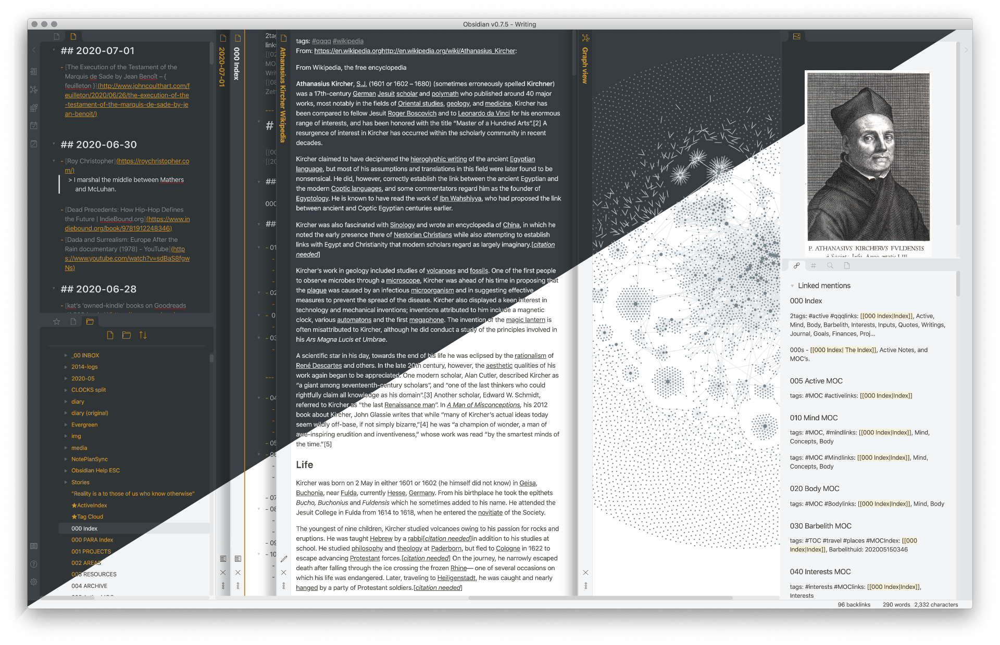

# Ars Magna theme for Obsidian

_The World is bound with Secret Knots  -- A. Kircher_

A theme for Obsidian that is a synthesis of lots of other people's work, as is fitting. Originally based on [deathau's](https://github.com/deathau) Notation theme, incorporating his and [cotemaxime's) · GitHub](https://github.com/cotemaxime) work on [Andy Matuschak mode](https://forum.obsidian.md/t/andy-matuschak-mode-v2-7-updated-for-0-7-new-panes/170), plus a few other things that I wanted. Works equally well in lucis or umbra modes.

## Screenshots

## Install

Update: Obsidian now has automatic installation of themes. Go to Settings → Appearance and click Browse under community themes. 

If for some reason you want to download it manually, you can still: 

1. Download obsidian.css to your Obsidian vault folder.
2. In Obsidian, click _Settings_ → _Appearance_ and turn on "Custom CSS".

## Licence

It's licensed under [The Unlicense](./LICENSE).

