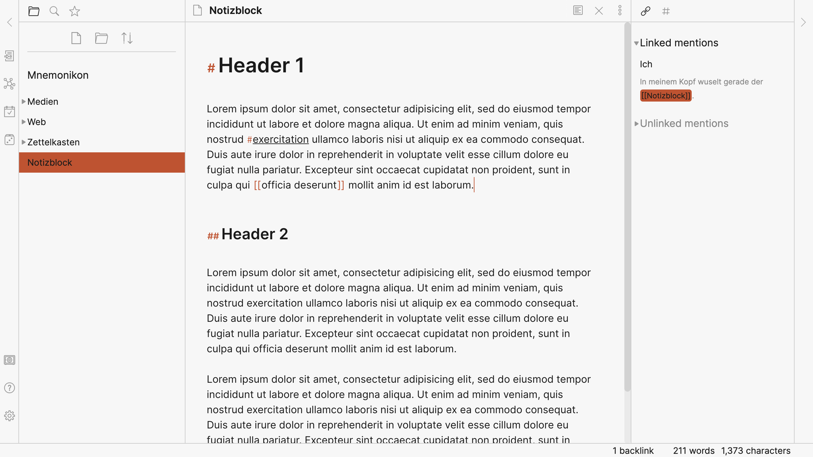
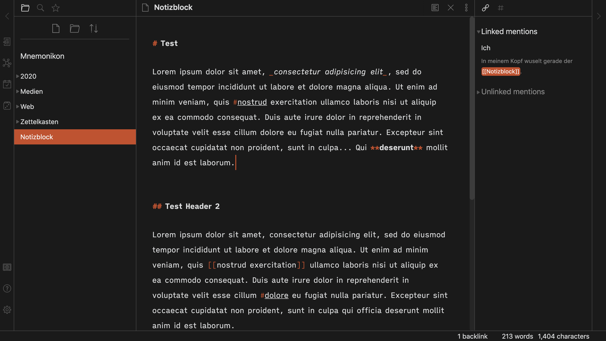
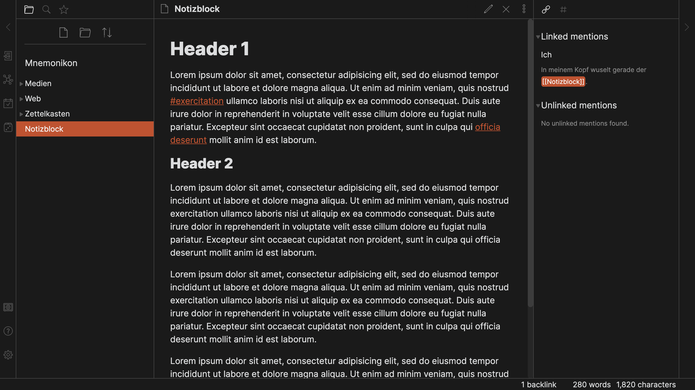
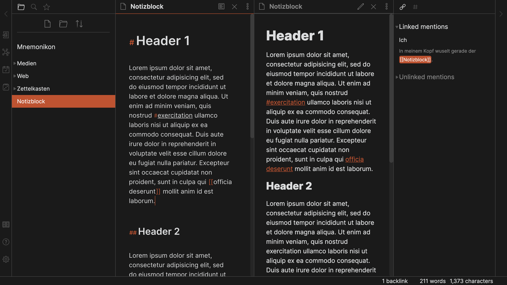
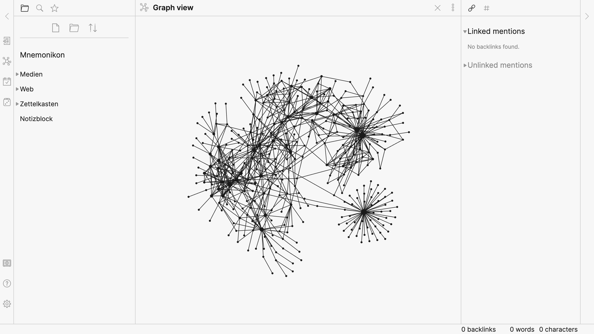
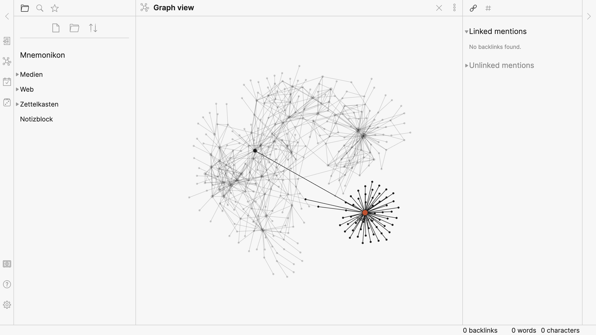
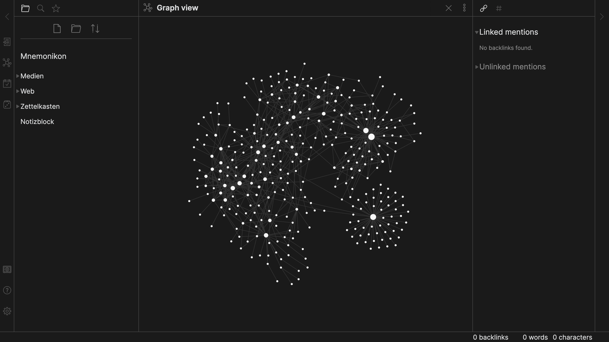
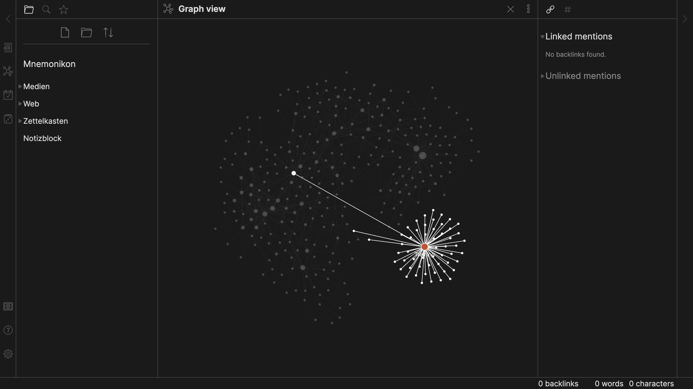

# BENWF theme for Obsidian

A dark and light theme for [Obsidian](https://obsidian.md), with UI elements inspired by the minimalism of [iA Writer](https://ia.net/writer), and based on ["Subtlegold" by Kartik Kulkarni](https://github.com/kartik-karz/subtlegold-obsidian).

## Install

1. Download obsidian.css to your Obsidian vault folder.
2. In Obsidian, click _Settings_ → _Plugins_ and turn on "Custom CSS".
3. There is no step 3, _except_ for when you want to use the font I use, then you'll have to install [iA Writer Quattro V](https://github.com/iaolo/iA-Fonts).

## Licence

It's licensed under [The Unlicense](./LICENSE).

## Screenshots

